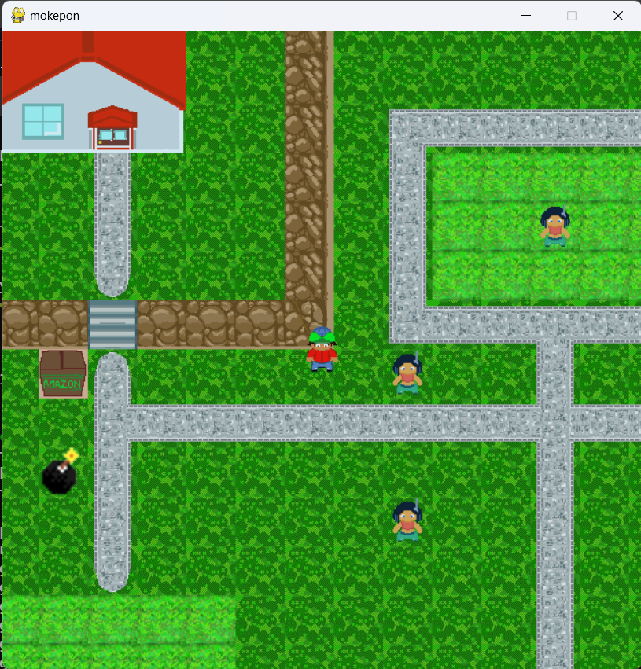

# My Highschool project
This is my and my project partner's school project for my high school
I have made the code reusable as much as possible.
Building your own levels or interactions is easier as I coded separate classes to handle the dirty work.
Just make sure to import the right classes to do your work.

oh yeah and forgot to mention, I coded a level maker as well, so you can use it to create your own levels.

